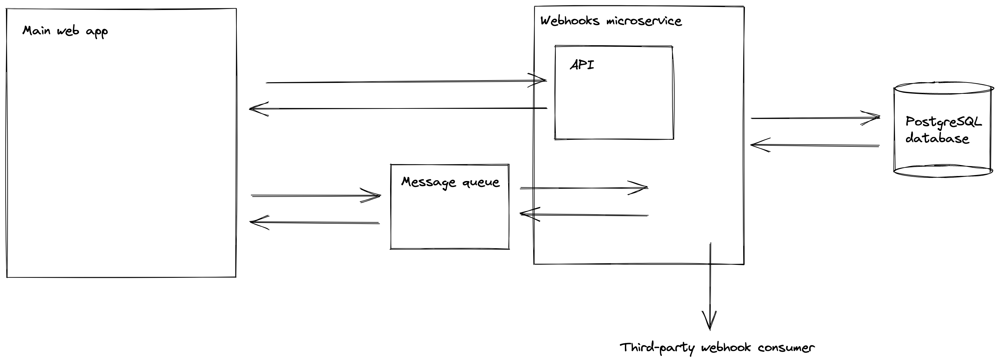

# Webhooks

An example of how webhooks might be implemented as an integration point for a web application.

## Tech stack

* Python, Django
* PostgreSQL
* ElasticMQ (In-memory message queue with an Amazon SQS-compatible interface. Runs stand-alone or embedded.)

## Architecture

A main web app exists and new webhooks functionality is added by creating a microservice.

## Example usage

    % docker-compose up

    % http POST localhost:8000/webhooks/ url=https://localhost:8001
    HTTP/1.1 200 OK
    [
        {
            "fields": {
                "url": "https://localhost:8001"
            },
            "model": "app.webhook",
            "pk": 6
        }
    ]

    